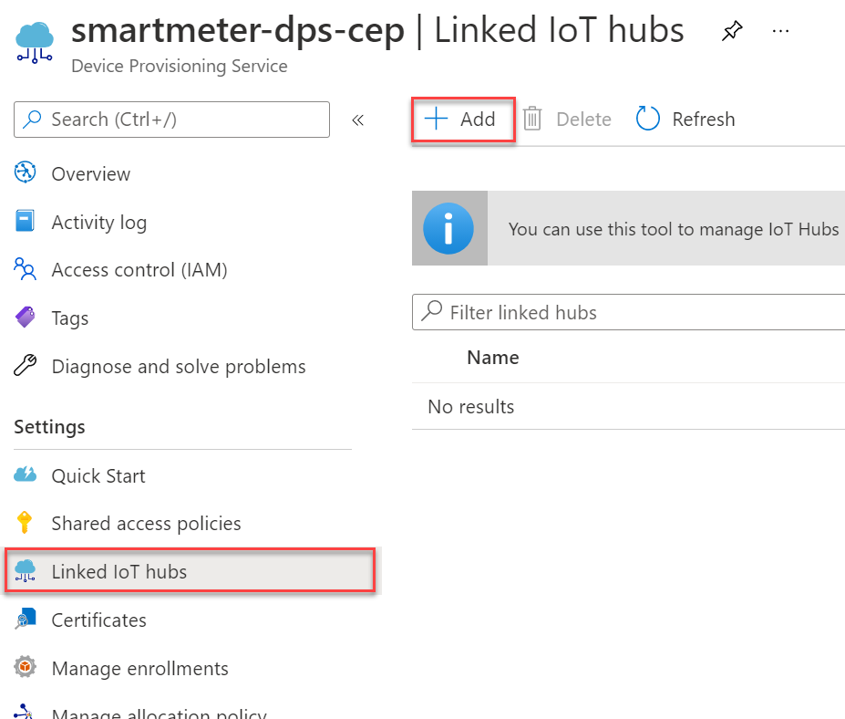
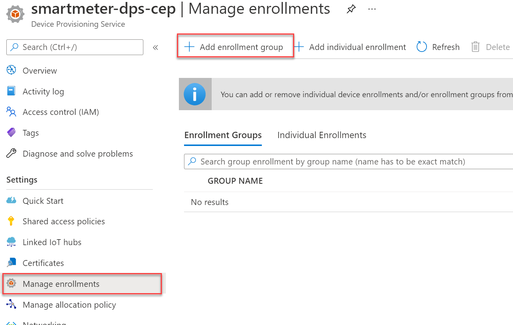
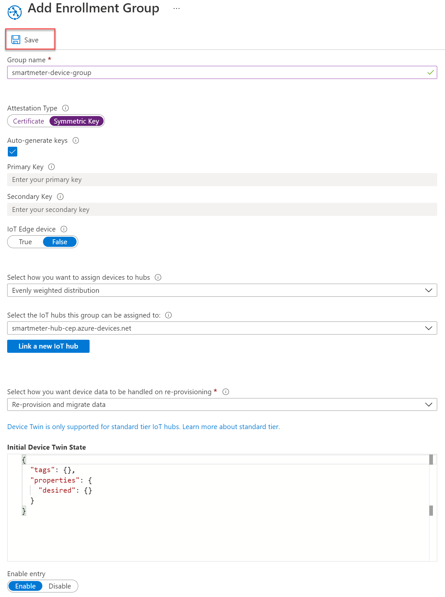
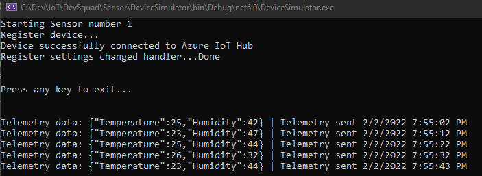

# DevSquad Project: Azure IoT Hub

In this workshop, you will deploy a [IoT reference arquitecture](https://docs.microsoft.com/en-us/azure/architecture/reference-architectures/iot), in specific you will deploy the following services to your Azure Suscription

* IoT Hub
* Device Provisioning Service
* Stream Analytics Job
* Storage Account


### #DemoTime

The structure of this project includes

* Sensor: A simulated device that uses the Azure IoT SDK, to test this project you will only need to update 2 lines of code to use your deployed services
* IaC: The ARM templates to deploy the required services into your suscription, you can deploy all the services together (azuredeploy-full) or deploy one bye one.
* .github/workflows GitHub actions to deploy the required services into your subscription. Use this link https://docs.microsoft.com/en-us/dotnet/architecture/devops-for-aspnet-developers/actions-deploy if you need additional information on how to configure this to work in your github repo

**It is recommended that you use Chrome as browser while executing the hands on lab**

### #How this demo works?

1. The simulated device will send every 10 seconds a telemetry message to the configured IoT Hub, to facilitate the registration of the device you will be using the service of Device Provisioning Service
2. The IoT Hub will receive the messages sent by the simulated device, an stream analytics job will take as input the IoT Hub, apply a query to specify how the data will be persited, in this case we will be using as output an Azure Storage Account Table.
3. At the end you will have persisted into an Azure Storage Table all the messages that the simulated device sent. This shows an example of a cold path, since the persisted information can then be analyzed by additional cloud services.

### Hands on Lab

Clone this repo and use the template on the ArmTemplate folder to deploy the required services. **You need to update the deploymentName value adding your initials at the end, for example iotdevsquad** , this is required since some services requires unique global name

### Task 1.  Linking the IoT Hub to the DPS (Device Provisioining Service)

1. Make sure your deployment includes 4 new resources:
    * IoT Hub
    * Device Provisioning Service
    * Storage Account
    * Stream Analytics Job

2. Link the IoT Hub to the DPS (Device Provisioning Service). Select your DPS, under settings click on "Linked IoT Hubs" and select Add



3. In the Add link to IoT hub blade, populate the form as follows, then select **Save**:

   - **Subscription**: Select the subscription you are using for this hands-on lab.
   - **IoT Hub**: Select the IoT Hub deployed using the ARM template
   - **Access Policy**: Select `iothubowner`.


4. Create an enrollment group

    Creating an enrollment group enables you to allow devices to self-register. This avoids the need to register each device manually. Group enrollments are made possible via secure Attestations, these could be via certificates or symmetric keys. In this example, we will use the symmetric key approach. Using symmetric keys should only be used in non-production scenarios, such as with this proof of concept.

    Remaining in the DPS resource, select **Manage enrollments** from the left menu, then select **+Add enrollment group** from the toolbar menu.

    

5. In the Add Enrollment Group form, populate it as follows, then select the **Save** button.

    - **Group name**: Enter `devsquad-device-group`.
    - **Attestation Type**: Select `Symmetric Key`.
    - **Auto-generate keys**: Checked.
    - **IoT Edge device**: Select `False`.
    - **Select how you want to assign devices to hubs**: Select `Evenly weighted distribution`.
    - **Select the IoT hubs this group can be assigned to**: Select `iotdevsquad-{SUFFIX}.azure-devices.net`.
    - **Select how you want the device data to be handled on re-provisioning**: Select `Re-provision and migrate data`.
    - **Initial Device Twin State**: Retain the default value.
    - **Enable entry**: Select `Enable`.
  
   

6. Select the newly created enrollment group from the **Enrollment Groups** list. On the Enrollment Group Details screen, copy the **Primary Key** value and record it for a future task. Remaining on the DPS resource, click on Overview and copy the "ID Scope". **To use the sample application, you will need to update the ID Scope and Primary key of your DPS**

### Task 2.  Updating the Device Simulator App

1. Open the solution Sensor/DeviceSimulator.sln, you will need to update lines 17 and 18 of Program.cs to include your idScope and enrollmentKey (primary Key from your Enrollment Group of DPS)

2. Debug the application, if everything works fine you will see something like this:

    

3. At this point, your simulated device is sending data to the IoT hub, the next step is to integrate with Stream Analytics to persist the telemetry into an Azure Storage Table.

### Task 3.  Configure the Stream Analytics Job

1. Navigate to your new Stream Analytics job in the portal. On the Stream Analytics job blade, select Inputs from the left-hand menu, under Job Topology, then select +Add stream input, and select IoT Hub from the dropdown menu to add an input connected to your IoT Hub.


2. On the **New Input** blade, enter the following:

- **Input alias**: Enter `temps`.
   - Choose **Select IoT Hub from your subscriptions**.
   - **Subscription**: Select the subscription you are using for this hands-on lab.
   - **IoT Hub**: Select the **iotdevsquad-SUFFIX** IoT Hub.
   - **Consumer Group**: Leave set to **\$Default**.
   - **Shared access policy name**: Select **service**.
   - **Endpoint**: Select **Messaging**.
   - **Partition Key**: Leave empty.
   - **Event serialization format**: Select **JSON**.
   - **Encoding**: Select **UTF-8**.
   - **Event compression type**: Leave set to **None**.

     

3. Select **Save**.

4. Next, select **Outputs** from the left-hand menu, under **Job Topology**, and select **+ Add**, then select **Table Storage** from the drop-down menu.

   

5. Enter the following:

    - **Output alias**: Set to `table`
    - **Check** `Select Table storage from your subscriptions` 
    - **table name**: Select **Create new** and provide a name, like `data`
    - **Partition key**: Enter `DeviceID`
    - **Row key**: Enter `Time`

    

6. Click save

7. Next, select **Query** from the left-hand menu, under **Job Topology**.

    


8. In the **Query** text box, paste the following query.

    ```sql
    SELECT Temperature, Humidity, IoTHub.ConnectionDeviceId as DeviceID, IoTHub.EnqueuedTime as Time
    INTO
    [table]
    FROM
    [temps]
    ```

9. Select **Save query**.

10. Return to the **Overview** blade on your **Stream Analytics job** and select **Start**.


11. In the **Start job** blade, select **Now** (the job will start processing messages from the current point in time onward).

    

12. Select **Start**.

13. Allow your Stream Analytics Job a few minutes to start. Make sure your simulator device app is still running

14. Once the Stream Analytics Job has successfully started, verify that you are showing a non-zero amount of **Input Events** on the **Monitoring** chart on the **Overview** blade. You may need to reconnect your devices on the **Smart Meter Simulator** and let it run for a while to see the events.

    

### Task 4. Visualize the persisted telemetry on the storage account

1. Navigate to your deployed Azure Storage Account in the portal, click on Storage browser (preview), select **Tables** and then choose the **data** table, you will see all the telemetry that initially was sent by the simulated sensor device

    


2. Consider stopping the Azure Stream Analytics job and stop the simulated device app or delete the resource group, remember that you can use the deployment template to redeploy the resources if required.


## Contributing

This project has adopted the [Microsoft Open Source Code of Conduct](https://opensource.microsoft.com/codeofconduct/). For more information see the [Code of Conduct FAQ](https://opensource.microsoft.com/codeofconduct/faq/) or contact [opencode@microsoft.com](mailto:opencode@microsoft.com) with any additional questions or comments.
  
> Note: This page is getting updated so make sure to check regularly for new resources.
